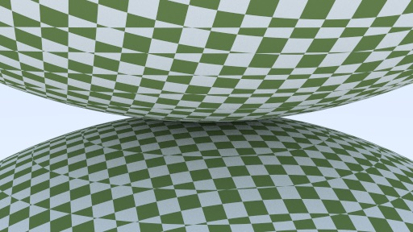

原理：路径追踪

参考：ray tracing in one week 系列

支持材质：

- Lambert (纹理映射)
- Metal
- Dielecric
- Berlin Noise
- emissive
- 均匀的烟雾

支持的后期处理：

- 景深

支持的基本形状：

- 矩形
- 球体
- 立方体

加速方法：

- 多线程加速
- BVH 加速结构
- 重要性采样，混合 PDF

### 样例

Lambert + Metal + Glass

Berlin Noise

纹理映射

面光源

带有玻璃球的 cornel box

带有烟雾的 cornel box

纹理映射 + Lambert + BVH + 玻璃球 + 磨砂金属球 + 场景充满烟雾

standard cornel box

